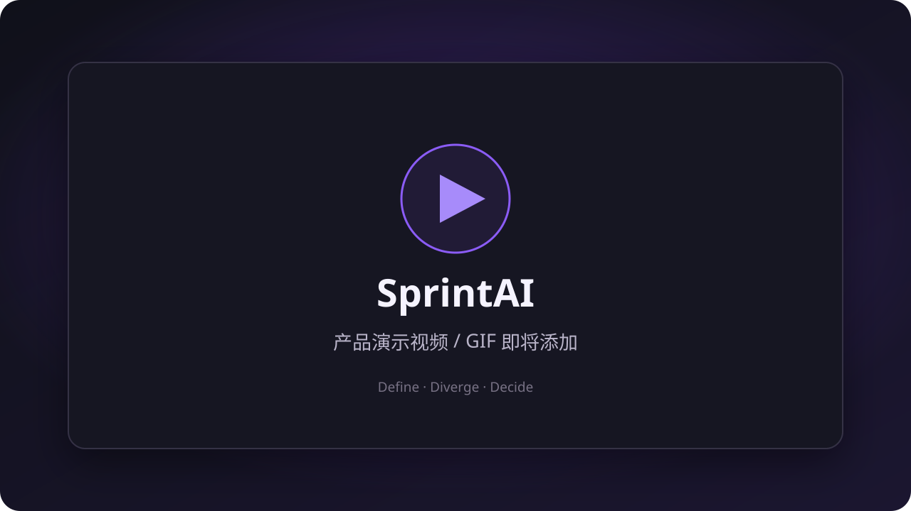

# SprintAI

> 一个人，也能带领一支 AI 团队完成一场设计冲刺

## 为什么做 SprintAI

一个人或小团队很难同时拥有产品、设计、工程、市场等完整角色，却仍然需要把一个模糊想法认真推演成一个敢于继续投入的方案

临时凑齐一支团队成本高、协调慢；只和通用 AI 聊天，又很容易得到散乱的观点，缺少角色分工、流程纪律与持续沉淀

SprintAI 想解决的，就是这段从“脑中有个想法”到“手上有套方案”之间的团队与方法缺口

## SprintAI 是什么

SprintAI 是一款多智能体设计冲刺应用，将设计冲刺方法改造成适合 AI 团队执行的结构化工作流

你可以带领由引导者、决策者和不同专业角色组成的 AI 团队，与它们共用一块实时白板，从定义问题、发散方案一路推进到决策收敛

AI 补齐角色、视角和流程纪律，最终方向始终由你决定

## 产品演示

正式使用视频或 GIF 将在这里展示

## 一场 SprintAI 冲刺如何进行

### 1. 定义问题

围绕长期目标、冲刺问题、用户旅程和真实用户输入，先把问题看清楚

### 2. 发散方案

多个智能体独立思考、分享点子、互相补充，再筛选和细化值得继续的方案

### 3. 决策收敛

通过方案批判、独立投票和理由说明逐步收敛，由你完成最终拍板，并生成故事板

## 核心功能

- **多智能体虚拟团队**：按引导者、决策者和专业成员分工协作
- **结构化设计冲刺**：用清晰的阶段和节点把讨论持续向结果推进
- **实时群聊与随时打断**：参与讨论、补充背景或随时接管方向
- **群聊与白板联动**：让笔记、流程图、点子、方案和故事板持续沉淀
- **阶段检查点**：在关键阶段审阅、修改和确认成果，再进入下一步
- **真人入场**：邀请目标用户、测试用户或行业专家提供真实信息
- **独立投票与理由说明**：减少从众，让每个判断都能被理解和追溯
- **用户最终拍板**：AI 提供建议，产品方向始终由你决定

后续将继续提高各阶段的产出质量，优化 Windows 桌面体验，并扩展更专业的智能体能力、工作方法与成果形式

## 它与普通 AI 对话有什么不同

| 普通 AI 对话 | SprintAI |
| --- | --- |
| 围绕一次次问答展开 | 围绕完整设计冲刺工作流推进 |
| 内容容易散落在聊天记录里 | 结构化白板持续承接所有产出 |
| 通常只有一个回答视角 | 多个角色独立思考、批判与协作 |
| 用户需要自己组织方法和节奏 | 引导者负责流程纪律，用户随时接管 |
| 对话结束就是终点 | 最终形成流程图、方案和故事板等可继续加工的成果 |

## 版权说明

SprintAI 是闭源软件，版权所有 © 2026 Findworth

下载或使用 SprintAI 不代表获得其源代码、品牌、视觉资产或其他知识产权的复制、修改与再分发权利，详情见 [LICENSE](LICENSE)

## 下载、更新与反馈

SprintAI 当前提供 Windows x64 版本

- [下载最新版本](https://github.com/Findworth/sprint/releases/latest)
- [查看历史版本与更新说明](https://github.com/Findworth/sprint/releases)
- [反馈使用问题](https://github.com/Findworth/sprint/issues/new?template=bug_report.yml)
- [提出功能建议](https://github.com/Findworth/sprint/issues/new?template=feature_request.yml)

请只从本仓库的 GitHub Releases 下载官方版本
